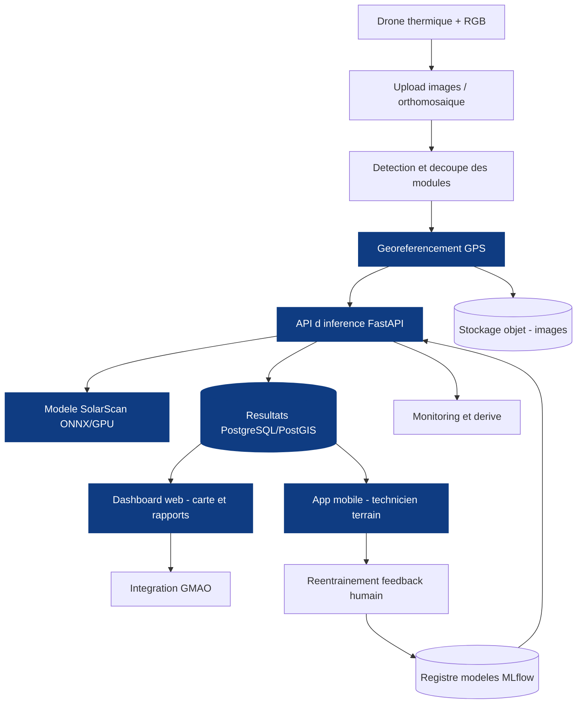
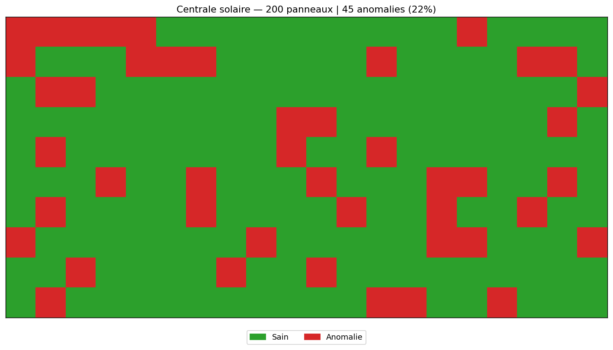

# SolarScan 🔆 — Détection de défauts sur panneaux solaires par imagerie thermique

Détection automatisée d'anomalies thermiques sur modules photovoltaïques à partir d'**imagerie infrarouge de drone**, par **apprentissage profond (Deep Learning)** et **transfer learning**.

Ce projet reproduit une brique clé de l'inspection automatisée de centrales solaires : à partir d'une image thermique d'un module PV, le modèle prédit s'il est sain ou affecté par l'une de **11 anomalies** (point chaud, cellule défectueuse, diode, salissure, ombrage, etc.).

---

## 🎯 Objectif

| | |
|---|---|
| **Tâche** | Classification d'images thermiques (12 classes) |
| **Modalité** | Imagerie infrarouge (thermique), 40×24 px niveaux de gris |
| **Approche** | Transfer learning (ResNet-18 → EfficientNet-B0) + TTA |
| **Enjeu** | Fort déséquilibre de classes (la classe *No-Anomaly* domine) |
| **Métriques** | Macro F1-score, accuracy, matrice de confusion |

---

## 📦 Dataset — InfraredSolarModules (Raptor Maps)

~20 000 images thermiques de modules PV, réparties en 12 classes.

Le dataset est distribué en une archive **`2020-02-14_InfraredSolarModules.zip`**. Télécharge-la depuis le [dépôt officiel](https://github.com/RaptorMaps/InfraredSolarModules) et décompresse-la dans `data/` pour obtenir :

```
data/
├── images/                 # 20 000 images thermiques .jpg, nommées par numéro (ex. 0.jpg)
└── module_metadata.json    # mapping numéro d'image -> classe d'anomalie
```

> Format du JSON : `{"0": {"image_filepath": "images/0.jpg", "anomaly_class": "Cell"}, ...}`
> Les images sont **à plat** dans `images/` (pas de sous-dossiers) ; la classe vient du JSON.

> Les 12 classes : `Cell`, `Cell-Multi`, `Cracking`, `Hot-Spot`, `Hot-Spot-Multi`,
> `Shadowing`, `Diode`, `Diode-Multi`, `Vegetation`, `Soiling`, `Offline-Module`, `No-Anomaly`.

---

## 🗂️ Structure du projet

```
SolarScan/
├── notebooks/        # 01→07 : EDA · baseline · CNN · Grad-CAM · démo Gradio
├── src/              # scripts CLI (alternative aux notebooks)
├── core/             # LOGIQUE MÉTIER (production)
│   ├── geo.py        #   géoréférencement EXIF (réel)
│   ├── detector.py   #   détection des modules (YOLO, branchable)
│   ├── classifier.py #   inférence du modèle
│   ├── severity.py   #   sévérité + perte kWh/€ par défaut
│   ├── pipeline.py   #   images → détection → classif → géo → sévérité → base
│   └── db.py         #   persistance SQLAlchemy (SQLite en local / PostGIS en prod)
├── serve/            # API FastAPI (+ Dockerfile) : /inspections, /panels, /predict
├── dashboard/        # poste d'inspection web (servi par l'API)
├── pipeline/         # run_inspection.py · geotag_demo.py
├── mobile/           # app Flutter (technicien terrain)
├── tests/            # tests (ex. test_geo.py — géoréférencement EXIF)
├── docker-compose.yml  # stack déployable : API + PostGIS
├── .env.example
└── data/  splits/  reports/   # données & sorties
```

---

## ⚙️ Installation

```bash
# Windows (la commande "python" est masquée -> on utilise "py")
py -m venv .venv
.venv\Scripts\activate
py -m pip install -r requirements.txt
```

---

## 🚀 Utilisation

```bash
# 1. Explorer la distribution des classes
py src/explore.py --data_dir data

# 2. Entraîner (transfer learning ResNet-18)
py src/train.py --data_dir data --epochs 15 --batch_size 64

# 3. Évaluer sur le jeu de test (métriques + matrice de confusion)
py src/evaluate.py --data_dir data

# 4. Visualiser une carte de chaleur Grad-CAM sur une image
py src/gradcam.py --image data/images/1000.jpg
```

---

## 📊 Résultats

Démarche **itérative** — chaque version corrige une faiblesse mesurée de la précédente :

| Modèle | Accuracy (test) | Macro-F1 (test) |
|---|---|---|
| ResNet-18 — transfer learning de base | 0.58 | 0.49 |
| ResNet-18 — recipe amélioré *(2 phases, LR↓ + cosine, pondération adoucie, label smoothing)* | 0.80 | 0.65 |
| **EfficientNet-B0 + TTA — modèle final** | **0.79** | **0.66** |

> Un classifieur naïf (toujours *No-Anomaly*) plafonne à ~0.06 de macro-F1 malgré ~50 % d'accuracy → d'où le choix du **macro-F1** comme métrique principale.

**Lecture par classe :** les anomalies à signature spatiale nette sont bien détectées (**Diode** F1 0.96, **No-Anomaly** 0.89) ; les classes rares et subtiles (**Soiling**, **Hot-Spot**) restent plus difficiles — limite liée au **faible nombre d'exemples** (31-37 en test), pas au modèle.

Toute la démarche (EDA → préparation → baseline → modélisation → amélioration) est détaillée dans les notebooks `notebooks/01` à `04c`.

---

## 🧠 Choix techniques

- **Transfer learning en 2 phases** : on entraîne d'abord la tête (backbone gelé), puis on fine-tune tout avec un LR faible (1e-4) + cosine — pour ne pas détruire les features pré-entraînées.
- **Déséquilibre de classes** : pondération adoucie (√) puis **sur-échantillonnage** (`WeightedRandomSampler`) des classes rares.
- **Régularisation** : AdamW + weight decay, label smoothing, augmentation (flips, rotation, translation).
- **Test-Time Augmentation (TTA)** : moyenne des prédictions sur l'image et ses miroirs (gain « gratuit »).
- **Sélection du modèle** : meilleur **macro-F1** sur la validation (et non l'accuracy, trompeuse en cas de déséquilibre).
- **Explicabilité** : Grad-CAM pour vérifier que le modèle regarde bien la zone chaude.

---

## 🏭 Architecture de production (vision opérationnelle)

Les notebooks produisent un **prototype** : le *classifieur*. En conditions réelles, une centrale compte des **dizaines de milliers de panneaux** — il faut un **système**, pas une simple application.



**Légende :** en bleu = **implémenté & testé** (modèle, API, **géoréférencement EXIF réel**, base **PostGIS**, **dashboard web**, **app mobile**). Reste sur la feuille de route : **détection amont** (YOLO — attend des frames de centrales annotées), MLOps (MLflow, monitoring), intégration GMAO.

**Interface utilisateur :** le **dashboard web** est le cœur (ingénieurs d'inspection : carte, rapports, filtres) ; l'**app mobile** est un compagnon terrain (navigation GPS vers le panneau, validation des tickets, hors-ligne). Une **validation humaine** reste dans la boucle (les fausses alertes coûtent du temps technicien).

### 🛰️ Exemple — rapport d'inspection automatisé

`pipeline/run_inspection.py` simule un **vol drone** sur une centrale : chaque panneau est classé, **géoréférencé** (GPS) et reporté.



Sortie : `reports/report.csv` (position, GPS, état, type de défaut) + la **carte** ci-dessus. Exemple sur 200 panneaux : **45 anomalies (22 %)** localisées — vert = sain, rouge = anomalie.

### 🔌 API d'inférence (`serve/api.py`)

```bash
uvicorn serve.api:app --port 8000      # doc interactive : http://127.0.0.1:8000/docs
# ou en conteneur :
docker build -t solarscan-api -f serve/Dockerfile . && docker run -p 8000:8000 solarscan-api
```

### 🖥️ Poste d'inspection web (`dashboard/index.html`)

Servi par l'API à la racine (**http://localhost:8090/**) : KPIs, **carte satellite** des panneaux (GPS réel), priorisation par **sévérité** et **perte €/an**, et **workflow** de maintenance (valider / fausse alerte / réparé) écrivant en base.

*Vue rapide alternative (folium/Streamlit)* : `streamlit run dashboard/app.py`.

### 📱 App mobile terrain (`mobile/`)

App **Flutter** pour le technicien sur site : anomalies triées par gravité, **navigation GPS** vers le panneau, mise à jour du statut. Consomme l'API REST (CORS activé).

```bash
cd mobile && flutter create . && flutter pub get && flutter run
```

---

## 🚀 Déploiement (Docker)

Toute la stack — **API + dashboard + base PostGIS** — démarre en une commande :

```bash
cp .env.example .env            # ajuster le mot de passe pour la prod
docker compose up -d --build
# dashboard : http://localhost:8090/   ·   API + doc : http://localhost:8090/docs
```

- Le **modèle** (`solarscan_resnet18.pt`) n'est pas figé dans l'image : il est **monté en volume** au runtime (chemin via `MODEL_FILE`).
- Données persistées dans **PostgreSQL/PostGIS** (volume `pgdata`). En local sans Docker, l'app retombe automatiquement sur **SQLite** — zéro config.
- Conteneurs avec **healthchecks** et `restart: unless-stopped`.

> Vérifié de bout en bout : création d'inspection via l'API → écriture en PostGIS → restitution dans le dashboard.

---

## 👤 Auteur

**Souleymane Diallo** — Élève-ingénieur IA & Data Science, ENSAM Meknès
[LinkedIn](https://www.linkedin.com/in/souleymane-diallo-51214728b/) · [Portfolio](https://jeuf-tech-portfolio.vercel.app/)
